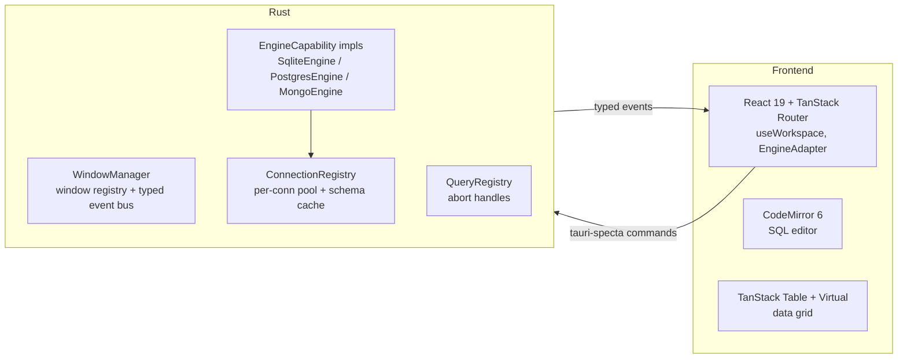

# Based — Architecture

This document captures the architectural decisions that shape `based`. Keep it current so we don't relitigate the same questions every few weeks.

## Product thesis

A **git-friendly**, **local-first** desktop database client for **Postgres, MongoDB, and SQLite**, designed to feel:

- **DataGrip-dense** for power users — 12–13 px base type, 26 px rows, 28 px toolbars, keyboard-first, command palette, EXPLAIN / DDL always one click away.
- **Supabase-approachable** for developers whose first database was a managed service — paste-a-URL connection wizard with engine auto-detect, bundled sample projects, "Beginner / Pro" mode toggle, plain-English affordance popovers.

The git-friendly wedge is the project model: a `.based/` directory committed to the repo containing `config.toml` (connections) and `queries/*.query.toml` (saved queries), with secrets resolved from `.based/.env` (git-ignored) or host environment variables. No backend, no pricing, no data ever leaves the machine.

## Native GPUI client (`apps/desktop-native`) — Phase 6 decision gate

The repo also contains **`desktop-native`**, an experimental **GPUI + gpui-component** shell. This is a **spike / parallel track**, not a wholesale UI migration. It exists to validate native density, docking, and multi-window behavior without throwing away the shipping Tauri client.

**Validated so far:**

- Workspace shell with sidebar, dock, and status bar; connections loaded from `.based/config.toml`.
- Engine vertical slices for **SQLite**, **Postgres**, and **MongoDB** using **gpui_tokio** for async database work.
- **Pop-out windows:** the tab ⋮ menu includes **Open in new window**, which calls `App::open_window` and wraps the **same panel `Entity`** in a new `Root`. The popped window therefore shares live state with the main dock (not a clone of panel logic).

**Still a weak substitute for the Tauri stack today:** CodeMirror-grade SQL editing, the TanStack Table + filter ecosystem, shadcn/Radix component depth, and the stability of public webview APIs. GPUI follows Zed's release cadence; third-party ergonomics remain thinner than Electron/Tauri.

**Decision:** The **90-day parity** and production bets stay on **Tauri 2 + React** until a deliberate, resourced program reopens full migration. The GPUI app remains a **green-lit experiment**: we continue it where it reduces technical risk (native density, OS-window model) and **do not** block Tauri milestones on GPUI parity.

## UI framework decision: Tauri 2

We evaluated **iced**, **egui**, **Dioxus Desktop**, and **GPUI** against the current Tauri stack. For **shipped product through the parity sprint**, **Tauri stays**. Reasoning:

| Framework | SQL editor | Data grid | Design system | Multi-window | Rewrite cost |
| --- | --- | --- | --- | --- | --- |
| **Tauri (current)** | CodeMirror 6 (best-in-class) | TanStack Table 8 + `react-virtual` | shadcn/ui + Tailwind | `WebviewWindowBuilder` — first-class | 0 |
| iced | None production-grade | Nascent (`iced_aw`) | None | Supported since 0.13, rough | ~6 months |
| egui | `egui_code_editor`, basic, no autocomplete | `egui_extras::TableBuilder` (read-only) | Immediate-mode, limited styling | OK | ~6 months |
| Dioxus Desktop | Same webview as Tauri; would port React → RSX | Nothing matching TanStack Table | No shadcn equivalent | Same as Tauri | ~4-6 months (no capability gain) |
| GPUI (Zed) | Zed's editor, not packaged as a widget | None | None — Zed internals only | Works inside Zed; third-party is raw | 9-12 months on an unstable crate |

### Why the alternatives lose

- **iced**: Reimplementing CodeMirror-level SQL editing and a filterable/sortable/editable virtualized 1M-row grid is multiple years of work alone.
- **egui**: Immediate-mode is a poor fit for the complex, stateful forms we need (connection wizard, params editor, row insert dialog). Styling is constrained in ways that make Supabase-level polish infeasible.
- **Dioxus Desktop**: Runs on the **same `wry` webview Tauri does**, so there is no architectural win re: multi-window, memory, or platform consistency. Migrating would discard the React + shadcn + CodeMirror + TanStack Table ecosystem for zero capability gain. "I prefer Rust syntax" is not a sufficient reason to pay that cost.
- **GPUI**: The only candidate that could plausibly beat Tauri on raw UI density (Zed's aesthetic). The `gpui` crate is still not a turnkey product framework: API churn, thin third-party docs, and most Zed primitives are not packaged as reusable widgets. **desktop-native** shrinks that uncertainty for *our* use case (dock, data grid, multi-window) but does not erase the editor/ecosystem gap. Remains **high risk for a solo 90-day *replacement* sprint**; acceptable as a **parallel spike** (see **Native GPUI client** above).

### Why the stated goals don't require leaving Tauri

- **Multi-window**: Tauri 2's `WebviewWindowBuilder::new(app, "label", WebviewUrl::App("/result".into()))` spawns a real OS window with its own React tree — the same model VS Code, Linear, Slack, and Cursor ship today.
- **Tabs within a window**: TanStack Router + persisted tab stack. Drag-to-detach is a handover to `WindowManager`.
- **DataGrip density**: a design-token problem, not a framework problem. VS Code is Electron. Linear is a webview app. Density is purely how small you set font sizes, row heights, and toolbars.

### Assets we'd throw away by migrating

- ~3,000 LOC of working Rust: connector trait, `ConnectionRegistry`, `ConnectionPool`, `file_watcher`, `variables`, `project_commands`, `project_db_commands`.
- ~9,000 LOC of TSX, with hard-to-replace pieces:
  - CodeMirror 6 SQL editor (`@codemirror/lang-sql`, themes, autocomplete hook).
  - TanStack Table 8 with virtualization, sorting, pagination.
  - An 864-LOC data-table filter kit we'd re-invent badly.
  - shadcn/ui + Radix primitives for every dialog/menu/popover.

The production default is codified in [based_90-day_parity_plan_02f75bec.plan.md](.cursor/plans/based_90-day_parity_plan_02f75bec.plan.md). Revisit full migration only on a **deliberate** basis (e.g. GPUI gains a stable widget story we would actually adopt, a sponsor-level investment in native UI, or a platform change that breaks the Tauri value proposition).

## High-level component diagram



## Multi-window model

- **Main window** (label `main`): project + connections + table browser + query editor.
- **Child windows** spawned via `WindowManager`:
  - `settings` — separate OS window for preferences.
  - `wizard` — connection wizard.
  - `result:<id>` — detached result viewer.
  - `table:<id>` — detached table browser.
  - `tab:<uuid>` — a dragged-out tab.

Source of truth for shared state (active project, active connection, schema cache, query registry) lives in **Rust**. Frontend nanostores are per-window view models that subscribe to typed `WorkspaceEvent`s emitted by the backend.

## Key abstractions

### EngineCapability (Rust)

```rust
#[async_trait]
pub trait EngineCapability: Send + Sync {
    async fn list_objects(&self, ...) -> Result<Vec<ObjectNode>, Error>;
    async fn describe_table(&self, ...) -> Result<TableDescription, Error>;
    async fn browse_table(&self, ...) -> Result<QueryResult, Error>;
    async fn insert_row(&self, ...) -> Result<(), Error>;
    async fn update_row(&self, ...) -> Result<(), Error>;
    async fn delete_rows(&self, ...) -> Result<u64, Error>;
    async fn run_raw(&self, ...) -> Result<QueryResult, Error>;
    async fn explain(&self, ...) -> Result<ExplainPlan, Error>;
}
```

Implemented by `SqliteEngine`, `PostgresEngine`, `MongoEngine`. `#[tauri::command]` functions are thin dispatchers.

### EngineAdapter (Frontend)

Mirrors `EngineCapability` one-to-one. A single `<DatabaseTree>` component renders `adapter.listObjects()` nodes instead of three bespoke tree components.

### WorkspaceAddress

All IPC calls accept:

```rust
pub struct WorkspaceAddress {
    pub project_path: PathBuf,
    pub conn_key: String,
    pub tab_id: Option<Uuid>,
}
```

Derived IDs (hashes, URL-safe base64) are computed from it, never passed separately.

### Error taxonomy

```rust
pub enum Error {
    Config { path: PathBuf, detail: String },
    Connection { addr: WorkspaceAddress, source: ConnectionErrorKind },
    Query { query: String, engine: Engine, source: QueryErrorKind },
    NotFound { what: String },
    // ... transparent wrappers for sqlx / mongodb / io / serde
}
```

The UI can show different surfaces per variant (wizard vs toast vs inline-red).

## IPC boundary

All Tauri commands are annotated with `#[specta::specta]`. `tauri-specta` emits `src/bindings.ts` at build time — the single typed entry point the frontend imports. No handwritten wrappers, no magic-string `invoke<T>('...')` calls in components.

## Project file layout

```
.based/
  config.toml          # project + connections (committed)
  .env                 # secrets (git-ignored)
  queries/
    *.query.toml       # saved queries (committed)
  state/               # per-user workspace state (git-ignored)
    tabs.json
    column-widths.json
```

## Day-90 invariants

After the 90-day parity sprint:

1. Postgres / MongoDB / SQLite pass the same integration test matrix.
2. Adding a new feature is **O(1) per engine**, not O(features × engines).
3. IPC boundary has **zero** handwritten `invoke<T>('...')` calls; all go through generated bindings.
4. No component exceeds ~300 LOC; no Rust file exceeds ~400 LOC.
