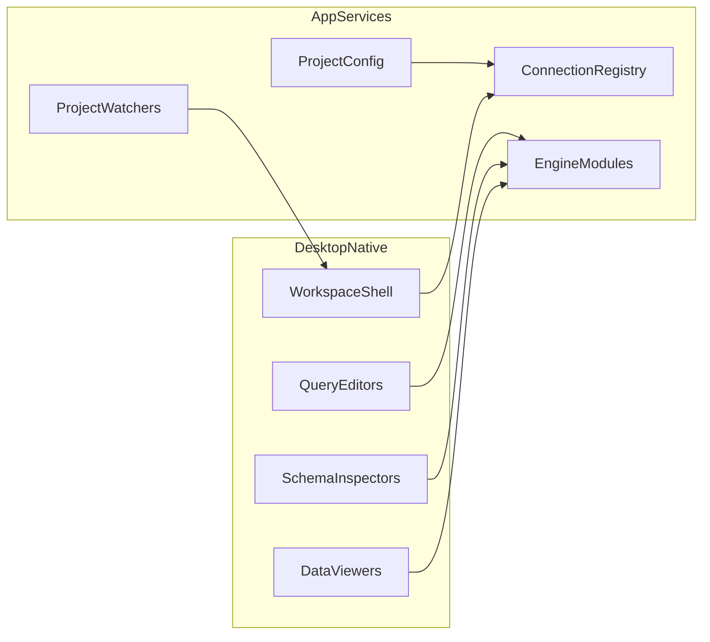

# Based - Architecture

This document captures the current production architecture for `based`.

## Product thesis

A **git-friendly**, **local-first** desktop database client for **Postgres, MongoDB, and SQLite**.

The project model is centered on a committed `.based/` folder:

- `config.toml` - project + connection metadata (committed)
- `.env` - local secrets (git-ignored)
- `queries/*.query.toml` - saved queries (committed)
- `state/` - per-user workspace state (git-ignored)

## App runtime

The desktop app is **pure Rust** and lives in `apps/desktop-native`.

- UI: `gpui` + `gpui-component`
- Async runtime bridging: `gpui_tokio`
- Data engines: SQLx-backed SQL engines and MongoDB driver
- Windowing: native multi-window behavior through GPUI app/window primitives



## Repository layout

```text
based/
├── apps/
│   └── desktop-native/
├── docs/
├── .based/
├── Cargo.toml
└── mise.toml
```

## Day-to-day invariants

1. `desktop-native` is the only desktop runtime target.
2. CI/release workflows use Cargo-only pipelines.
3. New backend or engine work is implemented in Rust modules under `apps/desktop-native/src`.
4. Shared code extraction should move to `crates/*` only when a module is reused by more than one binary/library target.
