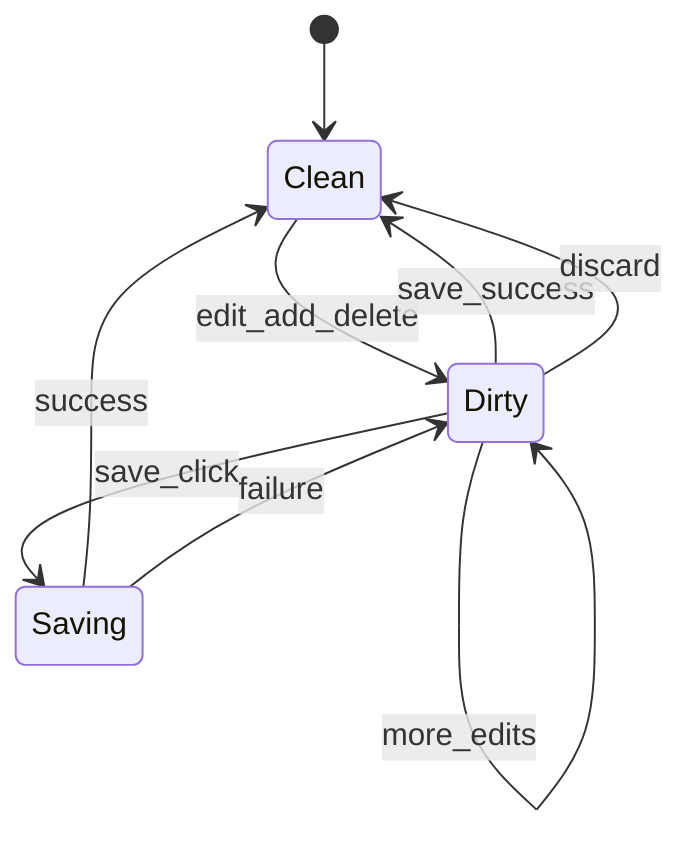

# Track D: Results Grid & Data Editing

**Goal:** Inspect query results and table data efficiently; edit rows with explicit save/discard—never silent commits.

**Primary code:** `widgets/data_table.rs`, `widgets/virtual_table.rs`, `postgres/data_viewer.rs`, `postgres/mutations.rs`, `widgets/pagination.rs`, `widgets/filter_bar.rs`

## Functional requirements

### Result grid (query output)

| ID | Requirement | Priority |
|----|-------------|----------|
| D-F1 | Tabular columns from result metadata; NULL display distinct from empty string | P0 |
| D-F2 | Column sort (client-side on loaded page) | P0 |
| D-F3 | Column filter / quick search (client-side) | P0 |
| D-F4 | Copy cell, row, selection to clipboard | P0 |
| D-F5 | Pagination or virtual scroll for large sets | P0 |
| D-F6 | Export CSV and JSON for current result set | P0 |
| D-F7 | Truncation warning when result capped by limit | P0 |

### Table data tab (browse/edit)

| ID | Requirement | Priority |
|----|-------------|----------|
| D-F8 | Open table data from explorer; paginated `SELECT *` with configurable page size | P0 |
| D-F9 | Inline edit cell values (type-aware editors P1; text fallback P0) | P0 |
| D-F10 | Add row (empty template) and delete row (mark pending) | P0 |
| D-F11 | **Dirty state** banner: “Unsaved changes (N)” | P0 |
| D-F12 | **Save changes** commits pending mutations in transaction | P0 |
| D-F13 | **Discard changes** reloads last committed snapshot | P0 |
| D-F14 | Mutation summary after save: inserted/updated/deleted counts | P0 |
| D-F15 | Primary key required for update/delete; warn if no PK | P0 |

## Non-functional requirements

| ID | Requirement |
|----|-------------|
| D-NF1 | Scroll 10k loaded rows without UI freeze (virtualization) |
| D-NF2 | No commit on blur, tab switch, or window close |
| D-NF3 | Save button disabled when not dirty; double-submit guarded |
| D-NF4 | Failed save retains dirty buffer for correction |
| D-NF5 | Page fetch &lt; 2s on local LAN for 500-row page |

## Write workflow (state machine)



### Navigation guard

When `Dirty` and user closes tab, switches connection, or quits app:

- Modal: **Save changes** | **Discard** | **Cancel**
- Cancel returns to tab without side effects.

## UI: Result grid

- Frozen header row.
- Row numbers optional (P1).
- Footer: `Showing 1–500 of 12,431 (limited)` when capped.
- Export dropdown: CSV, JSON — exports **loaded** rows unless “export all” deferred P1.

## UI: Table data tab

```
┌──────────────────────────────────────────────────────────┐
│ public.users                    [Refresh] [Filter…]    │
│ ⚠ Unsaved changes (3)     [Save] [Discard]               │
├──────────────────────────────────────────────────────────┤
│ id │ email           │ created_at                       │
│ 1  │ a@example.com   │ 2024-01-01                       │
│ *2 │ [new row]       │                                  │
├──────────────────────────────────────────────────────────┤
│ ◀ Page 1 of 24 ▶    Page size: 500                     │
└──────────────────────────────────────────────────────────┘
```

### Cell edit rules (P0)

| Type | Editor |
|------|--------|
| text/varchar | Inline text |
| integer/numeric | Text with validation on save |
| boolean | Toggle or dropdown |
| timestamp | ISO text with validation |
| json/jsonb | Text area popover P1 |

Invalid value → block save for that row with inline error.

## Mutation execution

- Single transaction per Save click.
- Order: deletes → updates → inserts (document in code).
- On partial failure: rollback entire save batch (P0); row-level retry P1.
- Use primary key columns from catalog metadata.

## Acceptance criteria

- [ ] **D-AC1:** Query returning 1000+ rows scrolls smoothly.
- [ ] **D-AC2:** Sort column ascending/descending works on loaded page.
- [ ] **D-AC3:** Export CSV opens correctly in spreadsheet app.
- [ ] **D-AC4:** Edit cell → dirty banner → Save → value persisted in DB.
- [ ] **D-AC5:** Edit cell → Discard → original value restored.
- [ ] **D-AC6:** Close tab while dirty shows Save/Discard/Cancel; Cancel keeps tab.
- [ ] **D-AC7:** Delete row + Save removes row in DB.
- [ ] **D-AC8:** Add row + Save inserts row.
- [ ] **D-AC9:** Failed save (e.g. constraint) shows error; dirty state retained.

## Gap analysis (current codebase)

| Item | Status |
|------|--------|
| Data table / virtual table | Implemented |
| Data viewer | Implemented (`data_viewer.rs`) |
| Mutations | Implemented (`mutations.rs`) |
| Explicit save/discard UX | Verify dirty banner + guards |
| Export CSV/JSON | Verify on result + data views |
| Filter bar | Widget exists — wire consistently |
| Navigation guard on dirty | Verify all exit paths |

## Implementation notes

- `DataEditSession` struct: `pending: Vec<RowMutation>`, `baseline: Snapshot`.
- Share grid config from `app/prefs.rs` (`DEFAULT_PAGE_SIZE`, table density).
- Result export: stream to file dialog via GPUI platform APIs.
